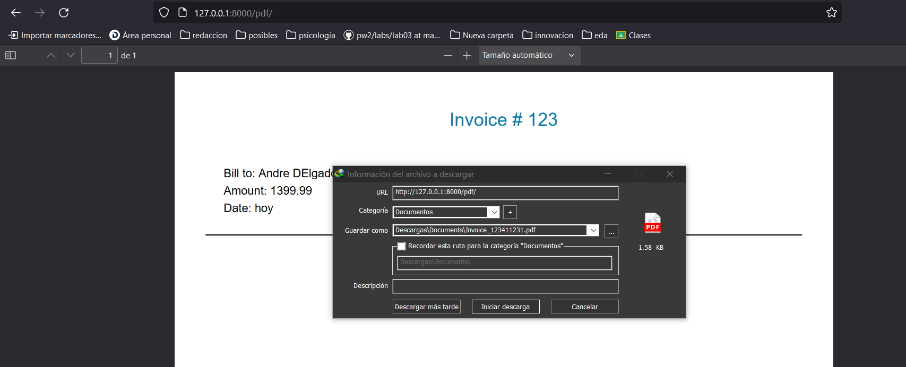
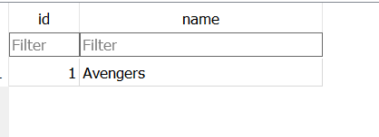
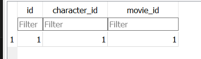

<div>
<table width="1000px">
    <theader>
        <tr>
            <td></td>
            <th>
                <span style="font-weight:bold;">UNIVERSIDAD NACIONAL DE SAN AGUSTIN</span><br />
                <span style="font-weight:bold;">FACULTAD DE INGENIERÍA DE PRODUCCIÓN Y SERVICIOS</span><br />
                <span style="font-weight:bold;">DEPARTAMENTO ACADÉMICO DE INGENIERÍA DE SISTEMAS E INFORMÁTICA</span><br />
                <span style="font-weight:bold;">ESCUELA PROFESIONAL DE INGENIERÍA DE SISTEMAS</span>
            </th>
            <td></td>
        </tr>
    </theader>
    <tbody>
        <tr><td colspan="3"><span style="font-weight:bold;">Formato</span>: Guía de Práctica de Laboratorio</td></tr>
        <tr><td><span style="font-weight:bold;">Aprobación</span>:  2022/03/01</td><td><span style="font-weight:bold;">Código</span>: GUIA-PRLD-001</td><td><span style="font-weight:bold;">Página</span>: 1</td></tr>
    </tbody>
</table>
</div>

<div align="center">
    <span style="font-weight:bold;">INFORME DE LABORATORIO</span><br />
</div>

<div align="center">
    <table width="1000px">
        <theader>
            <tr><th colspan="6">INFORMACIÓN BÁSICA</th></tr>
        </theader>
        <tbody>
            <tr><td>ASIGNATURA:</td><td colspan="5">Programación Web 02</td></tr>
            <tr><td>TÍTULO DE LA PRÁCTICA:</td><td colspan="5">Django Relaciones Uno a muchos y Muchos a muchos en BD</td></tr>
            <tr><td>NÚMERO DE PRÁCTICA:</td><td>07</td><td>AÑO LECTIVO:</td><td>2023 A</td><td>NRO. SEMESTRE:</td><td width="60px">  III  </td></tr>
            <tr><td>FECHA DE PRESENTACIÓN:</td><td>11-07-2023</td><td>HORA DE PRESENTACIÓN:</td><td colspan="3">12:00</td></tr>
            <tr>
              <td colspan="4">NOMBRE:
                <ul>
            	    <li>Andre David Delgado Allpan</li>
                </ul>
              </td>
              <td>NOTA:</td><td></td>
            </tr>
            <tr>
              <td colspan="6" width="1000px">DOCENTES:
                <ul>
        	        <li>Anibal Sardon Paniagua</li>
                </ul>
              </td>
            </tr>
        </tbody>
    </table>
</div>

# Django

[![License][license]][license-file]
[![Downloads][downloads]][releases]
[![Last Commit][last-commit]][releases]

[![Debian][Debian]][debian-site]
[![Git][Git]][git-site]
[![GitHub][GitHub]][github-site]
[![Vim][Vim]][vim-site]
[![Java][Java]][java-site]

## OBJETIVOS TEMAS Y COMPETENCIAS

### OBJETIVOS

- **Implementar** una aplicación en Django cpn email y pdf, además de aprender a utilizar las relaciones en base de datos.

### TEMAS

- Proyectos de Django
- Aplicaciones en Django
- Email en Django
- PDF en Django


## CONTENIDO DE LA GUÍA

### MARCO TEÓRICO

- [Documentación de Djando](https://docs.djangoproject.com/es/3.2/)

- Django utiliza el modelo relacional para representar datos en la base de datos. En este modelo, se utilizan tablas para almacenar la información y las relaciones se establecen mediante claves foráneas.

#

## Actividades

1. Crear un proyecto en Django <br>

2. Siga los pasos del video <br>

3. Use git y haga los commits necesarios para manejar correctamente la aplicación.

<br>

#

## Ejercicios Propuestos

<a href="https://flip.com/s/q9Ky6GHBs9jF"><span style="color:pink;">Video de explicación</span></a>
[](https://flip.com/s/q9Ky6GHBs9jF): https://flip.com/s/q9Ky6GHBs9jF

# Link de repositorio GittHub
https://github.com/andre98652/pweb-lab7.git


* **Django pdf y emails**

```python
Django PDF [✔]
Django EMAILS [✔]
```

# PDF
* **Ejecucion 1 de ejercicio: Visualizar**


* **Ejecucion 2 de ejercicio: Visualizar como PDF**


* **Ejecucion 3 de ejercicio: Descargar automatica**



# EMAIL

* **Ejecucion 1 de ejercicio: Visualizar**


* **Ejecucion 1 de ejercicio: Mensaje enviado**


# Django Relaciones Uno a muchos y Muchos a muchos en BD

```python
One To Many Relationships [✔]
Query One To Many [✔]
Many To Many Relationships [✔]
Many To Many Query [✔]
Database Settings [✔]
```
* **Consulta con filtro**


* **Consulta con filtro 2**


* **Agregando datos a tabla movies y character**


* **Visualizacion de tabla movie y character**




* **Vizualizacion de tabla ManyToMany**



* **Agregando datos a tablas con ManyToMany**


* **Consulta a tabla movies**


* **Consulta atraves de ManyToMany**


#


## REFERENCIAS

- https://www.w3schools.com/python/python_reference.asp
- https://docs.python.org/3/tutorial/

#

[license]: https://img.shields.io/github/license/rescobedoq/pw2?label=rescobedoq
[license-file]: https://github.com/rescobedoq/pw2/blob/main/LICENSE
[downloads]: https://img.shields.io/github/downloads/rescobedoq/pw2/total?label=Downloads
[releases]: https://github.com/rescobedoq/pw2/releases/
[last-commit]: https://img.shields.io/github/last-commit/rescobedoq/pw2?label=Last%20Commit
[Debian]: https://img.shields.io/badge/Debian-D70A53?style=for-the-badge&logo=debian&logoColor=white
[debian-site]: https://www.debian.org/index.es.html
[Git]: https://img.shields.io/badge/git-%23F05033.svg?style=for-the-badge&logo=git&logoColor=white
[git-site]: https://git-scm.com/
[GitHub]: https://img.shields.io/badge/github-%23121011.svg?style=for-the-badge&logo=github&logoColor=white
[github-site]: https://github.com/
[Vim]: https://img.shields.io/badge/VIM-%2311AB00.svg?style=for-the-badge&logo=vim&logoColor=white
[vim-site]: https://www.vim.org/
[Java]: https://img.shields.io/badge/java-%23ED8B00.svg?style=for-the-badge&logo=java&logoColor=white
[java-site]: https://docs.oracle.com/javase/tutorial/

[![Debian][Debian]][debian-site]
[![Git][Git]][git-site]
[![GitHub][GitHub]][github-site]
[![Vim][Vim]][vim-site]
[![Java][Java]][java-site]

[![License][license]][license-file]
[![Downloads][downloads]][releases]
[![Last Commit][last-commit]][releases]